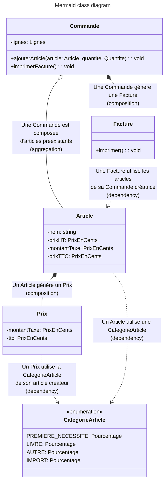

# Générateur de facture - Exercice de POO

## ÉNONCÉ

### Taxes

#### Story: Calcul de taxes

- Aucune taxe n'est appliquée sur les produits de premières nécessité, à savoir la nourriture et les médicaments.
- Une taxe sur la valeur ajoutée de 10% est appliquée sur les livres.
- Une taxe sur la valeur ajoutée de 20% est appliquée sur tous les autres produits.

- Une majoration de taxe de 5% est appliquée sur les produits importés, sans exception.

Le montant de chacune des taxes est arrondi aux 5 centimes supérieurs, selon la règle suivante :

| Taxe calculée | Taxe imputée |
| ------------- | ------------ |
| 0.99          | 1.00         |
| 1.00          | 1.00         |
| 1.01          | 1.05         |
| 1.02          | 1.05         |

Lorsque l'on passe une commande, une facture est émise listant chacun des produits ainsi que leur
prix TTC ; au bas de la facture figurent le montant total (TTC) ainsi que le montant total des taxes.

Le montant TTC est calculé comme suit :

- PrixTTC = PrixHT + somme(arrondi(PrixHT \* TaxeApplicable / 100))

Écrire une application, qui ne soit pas un modèle objet anémique, dans le language de programmation de votre choix. Elle imprime la facture détaillée pour chacun des paniers suivants :

---

##### INPUT

###### Input 1

- 2 livres à 12.49€
- 1 CD musical à 14.99€
- 3 barres de chocolat à 0.85€

###### Input 2

- 2 boîtes de chocolats importées à 10€
- 3 flacons de parfum importés à 47.50€

###### Input 3

- 2 flacons de parfum importés à 27.99€
- 1 flacon de parfum à 18.99€
- 3 boîtes de pilules contre la migraine à 9.75€
- 2 boîtes de chocolats importées à 11.25€

---

##### OUTPUT

###### Output 1

- 2 livres à 12,49 € : 27,48 € TTC
- 1 CD musical à 14,99 € : 17,99 € TTC
- 3 barres de chocolat à 0,85 € : 2,55 € TTC

  Montant des taxes : 5,50 €
  Total : 48,02 €

========================================

###### Output 2

- 2 boîtes de chocolats importées à 10,00 € : 21,00 € TTC
- 3 flacons de parfum importés à 47,50 € : 178,20 € TTC

  Montant des taxes : 36,70 €
  Total : 199,20 €

========================================

###### Output 3

- 2 flacons de parfum importés à 27,99 € : 69,98 € TTC
- 1 flacon de parfum à 18,99 € : 22,79 € TTC
- 3 boîtes de pilules contre la migraine à 9,75 € : 29,25 € TTC
- 2 boîtes de chocolats importées à 11,25 € : 23,70 € TTC

  Montant des taxes : 19,00 €
  Total : 145,72 €

========================================

---

## INSTALLATION

Le projet utilise Node.JS, TypeScript, et pnpm comme package manager.

- cloner le repo
- `pnpm i`

## UTILISATION

- pour exécuter l'app : `pnpm invoice`

---

## EXPLICATIONS

`ts-node` est utilisé pour exécuter le code sans émettre de JavaScript.
